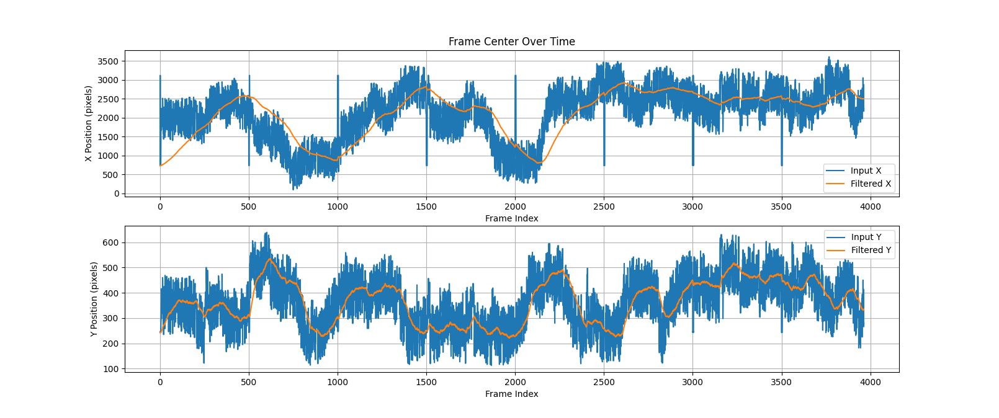
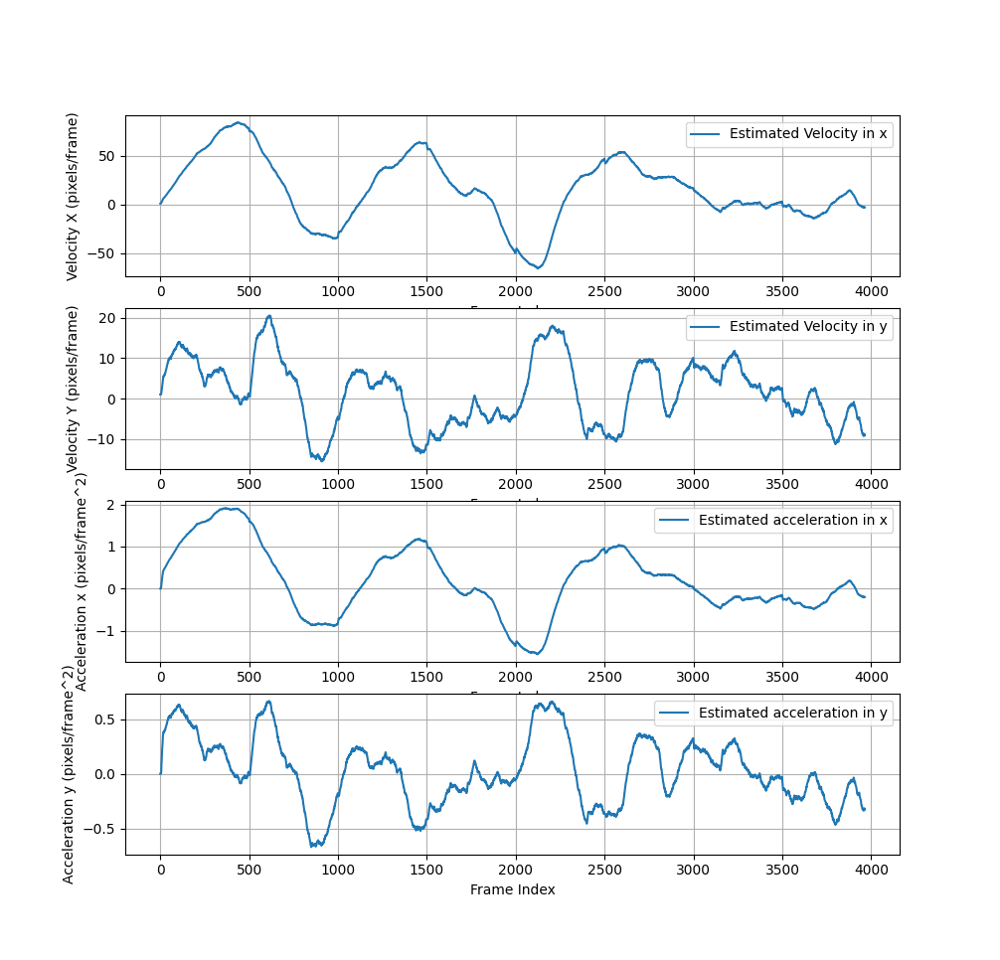

# 📦 Frame Boundaries Stabilization


---

# 📦 UKF2D — Unscented Kalman Filter for 2D Tracking

`UKF2D` is a simple implementation of a 2D Unscented Kalman Filter from scratch in Python. It is designed to estimate the **position, velocity, and acceleration** of an object using given noisy position measurements in x and y.

This filter is useful when the object's **velocity is not constant** — it assumes a **constant-acceleration motion model**, making it more robust to sudden changes in velocity.

More information can be found in this paper:
https://groups.seas.harvard.edu/courses/cs281/papers/unscented.pdf

---

## 🚀 Features

- ✅ 6D state: `[x, y, vx, vy, ax, ay]`
- ✅ Models non-constant velocity (supports acceleration)
- ✅ From-scratch UKF: no dependencies beyond `numpy`
- ✅ Modular design using a class (`UKF2D`)
- ✅ Tunable process and measurement noise
- ✅ Easily extensible for other applications

---

## 🛠️ Installation

The follwing python libraries are needed:

```bash
pip install numpy
pip install pandas
pip install matplotlib
pip install PIL
pip install opencv-python
pip install imageio
```

---

## 📋 Usage Example

```python
from ukf2d import UKF2D

def unscentedKalmanFilter(signal_x, signal_y, timestamp):
    """
    Apply 2D unscented Kalman Filter on given 2d noisy signal x,y 

    Args:
        signal_x (vector): Loaded panorama image.
        signal_y (vector): X coordinate of the crop center.
        timestamp (float): Y coordinate of the crop center.
        

    Returns:
        estimated state vectors - x, y, vx, vy, ax, ay 
    """

    # Init 2D Unscented Kalman Filter: 
    vx0 = 1.0
    vy0 = 1.0
    ax0 = 0.0
    ay0 = 0.0

    ukf = UKF2D([signal_x[0], signal_y[0], vx0, vy0, ax0, ay0], timestamp)
    
    for x_measure, y_measure in zip(signal_x, signal_y):
        # Estimate next frame state vector:
        x, y, vx, vy, ax, ay = ukf.step([x_measure, y_measure])
        print("Current state:",  x, y, vx, vy, ax, ay)
```

---

## ⚙️ Parameters

| Parameter         | Description                                           |
|------------------|-------------------------------------------------------|
| `x0`              | initial state values          |
| `process_noise`   | Process noise scale (affects responsiveness), can be float or list of float per state |
| `measurement_noise` | Noise scale for the measurement model, can be float or list of float per measure    |

---

## 📈 Output

Each call to `ukf.step(z)` returns the current state estimate:
```python
[x, y, vx, vy, ax, ay]
```
You can extract just the estimated position or all states as needed.

---


## 📚 Files

- `ukf2d.py` – The UKF2D class implementation
- `framesBoundaries.py` – Use ukf2d to estimate frame boundaries and create result plotting and analysis

---

## 📈 Algorithm Result and Analysis
The plot below illustrates the behavior of the input frame center signal before and after applying the Kalman filter:



The raw signal is highly noisy, exhibiting significant fluctuations that obscure the underlying trend. The noise may be due to various factors, such as measurement errors or external disturbances, making it difficult to extract meaningful information from the data.

Upon applying the Kalman filter, the signal is significantly smoother. The filter effectively reduces the noise, revealing a much clearer representation of the signal’s true behavior. This demonstrates the Kalman filter's ability to perform noise reduction while maintaining the core characteristics of the signal.

One notable side effect of the Kalman filter is the slight delay in the filtered signal. This delay occurs due to the filter’s reliance on previous and current measurements to estimate the state, which can introduce a phase lag, especially in real-time applications. While this delay is minimal, it is an important consideration when applying the filter in time-sensitive systems.

The plot below illustrate the velocity and acceleration, also estimated by this filter:



---
